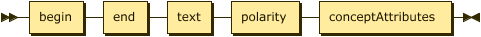
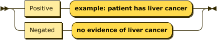
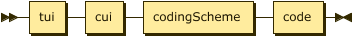

.. contents:: ctakes-client-py

Purpose: Extract Medical Concepts from Physician Notes
=======================================================
This package simplifies communication with CTAKES NLP servers which produce matches with UMLS Concepts.

- Clinical Text and Knowledge Extraction System (http://ctakes.apache.org)  
- UMLS Unified Medical Language System / National Library of Medicine (https://nlm.nih.gov/research/umls)

Quickstart
==============================
Clinical text fragment or entire physician note.
::
   physician_note = 'Chief Complaint: Patient c/o cough, denies fever, recent COVID test negative. Denies smoking.'
   output = ctakesclient.post(physician_note)

Output
==========================================
This client parses responses into lists of MatchText and UmlsConcept. 
::
    CtakesJSON(output)

    list_match() -> List[MatchText]
    
    list_concept() -> List[UmlsConcept]

    list_sign_symptom() -> List[MatchText]

    list_disease_disorder() -> List[MatchText]

    list_medication() -> List[MatchText]

    list_procedure() -> List[MatchText]

    list_anatomical_site() -> List[MatchText]

MatchText: Physician Notes
===================================
MatchText(s) are the character positions in the physician note where a UmlsConcept was found.

MatchText: Polarity
===================================

UMLS Concept
================================================

UMLS Vocabulary
================================================

    
UMLS Semantic Types and Groups
=========================================================
For convenience, the list of UMLS Semantic Types is provided here.

.. csv-table:: Semantic Types and Groupings
   :file: README/SemGroups_2018.csv
   :widths: 10, 20, 10, 60
   :header-rows: 1

   
   
   

	      
